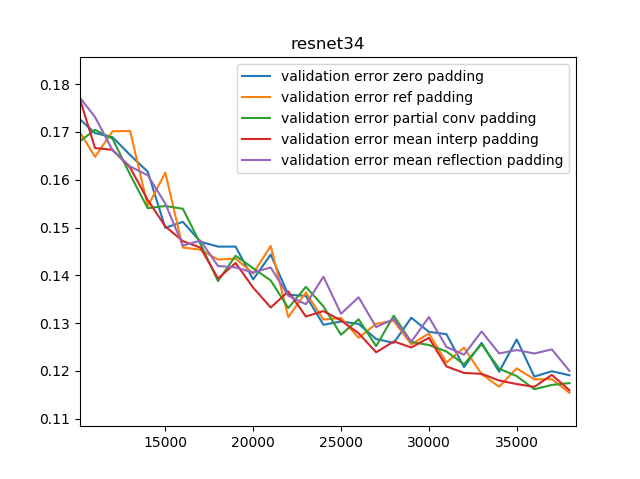
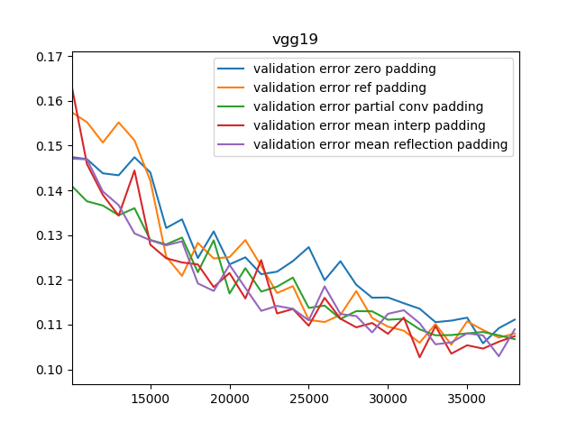

# Distribution padding

This is the official implementation of the ICIP paper "DISTRIBUTION PADDING IN CONVOLUTIONAL NEURAL NETWORKS".

 <p align='center'>
  
  
</p>

## Environment

Recently, I have experienced some NaN error caused by my custom frac_bilinear_upsampling. 
Therefore, the following environment is highly recommended.

[Python](https://www.python.org/) == 3.6

[Theano](http://deeplearning.net/software/theano/) == 1.0.3

[neuralnet](https://github.com/justanhduc/neuralnet)

[CUDA](https://developer.nvidia.com/cuda-zone) == 9.0

[CuDNN](https://developer.nvidia.com/cudnn) == 7.5

NVDIA GPU TiTAN X 12GB

If you encounter NaN, one workaround is to use the Theano's frac_bilinear_upsampling.
However, it will require some modification as the op does not accept symbolic variables for the resize argument.

## Training and evaluation

 To train the model on CIFAR10, simply run
 
 ```
 python train.py path/to/CIFAR10
 ```
 
 If the dataset is not in ```path/to/CIFAR10```, it will be automatically downloaded.
 By default, the model architecture is ResNet34 with mean interpolation padding. 
 Training will run for 100 epochs and evaluates on the test set every 1000 iterations.
 Type ```python train.py -h``` to see more customizations.
 
 ## Results
 
 <p align='center'>
  
  
</p>
 
 ## Citation
 
 __COMING SOON__
 
 ## References
 
 The partial convolution is adapted and simplified from the [official repo](https://github.com/NVIDIA/partialconv).
